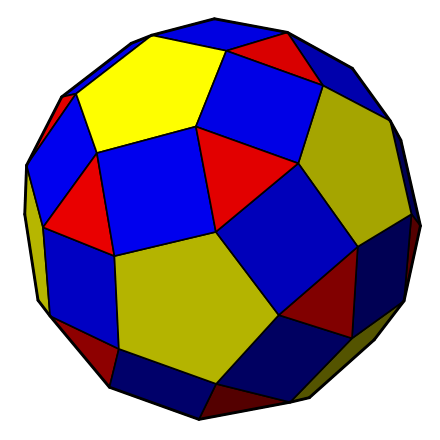

<!-- Repo must be public and named exactly "hberahma", or GitHub won't show this. -->
<!-- spin.gif must be committed to the repo root, next to this file. -->
<!--
  The banner is a raw <pre>, not a ``` fence, and the  sits directly
  against it with NO blank line between them. That is what kills the
  vertical offset: a blank line would make markdown wrap the image in a
  <p>, and that <p>'s 16px bottom margin would push the banner down.

  height="269" matches the banner box exactly:
    12 lines x (13.6px font x 1.45 line-height) = 237px
    + 16px padding top + 16px padding bottom     = 269px
  Recompute if you change the number of lines.
-->


<pre>
██╗  ██╗ █████╗ ███╗   ███╗███████╗ █████╗
██║  ██║██╔══██╗████╗ ████║╚══███╔╝██╔══██╗
███████║███████║██╔████╔██║  ███╔╝ ███████║
██╔══██║██╔══██║██║╚██╔╝██║ ███╔╝  ██╔══██║
██║  ██║██║  ██║██║ ╚═╝ ██║███████╗██║  ██║
╚═╝  ╚═╝╚═╝  ╚═╝╚═╝     ╚═╝╚══════╝╚═╝  ╚═╝
██████╗ ███████╗██████╗  █████╗ ██╗  ██╗███╗   ███╗ █████╗
██╔══██╗██╔════╝██╔══██╗██╔══██╗██║  ██║████╗ ████║██╔══██╗
██████╔╝█████╗  ██████╔╝███████║███████║██╔████╔██║███████║
██╔══██╗██╔══╝  ██╔══██╗██╔══██║██╔══██║██║╚██╔╝██║██╔══██║
██████╔╝███████╗██║  ██║██║  ██║██║  ██║██║ ╚═╝ ██║██║  ██║
╚═════╝ ╚══════╝╚═╝  ╚═╝╚═╝  ╚═╝╚═╝  ╚═╝╚═╝     ╚═╝╚═╝  ╚═╝
</pre>

Computer science undergraduate. Mostly Go and Rust.

[hberahma.com](https://hberahma.com) · [LinkedIn](https://www.linkedin.com/in/hamza-berahma) · [hberahma@acm.org](mailto:hberahma@acm.org)
